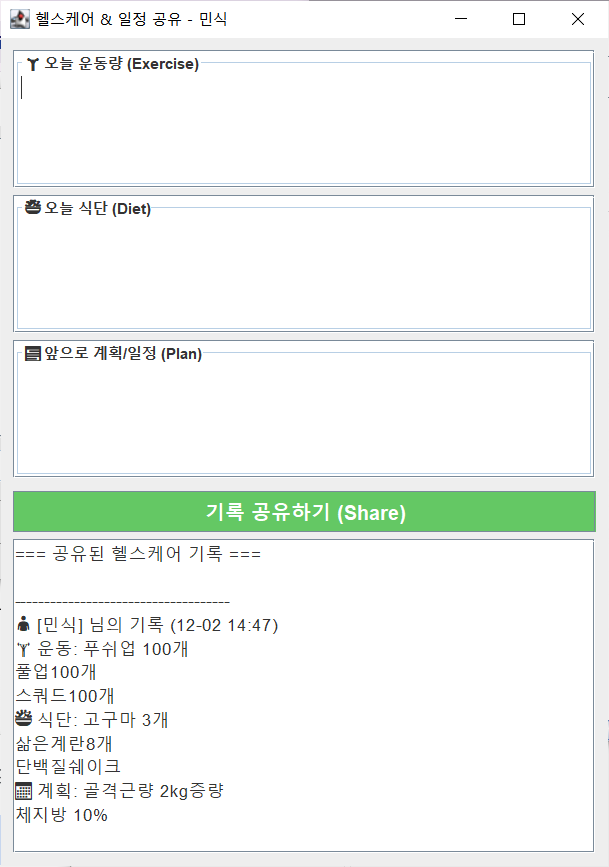

# 🌿 Mint Talk (Java Chat Application)

**Java Swing과 Socket 통신을 활용한 실시간 멀티 채팅 메신저 프로젝트입니다.**
카카오톡과 유사한 UI/UX를 기반으로 프로필 사진 변경, 이미지/이모티콘 전송 기능을 제공하며, **사용자의 운동 및 식단을 기록하고 공유하는 헬스케어 기능**을 새롭게 구현했습니다.

## 📸 Screenshots

| 로그인 화면 | 친구 목록 | 채팅방 (이미지/이모티콘) | 프로필 상세 | 헬스케어 (NEW) |
| :---: | :---: | :---: | :---: | :---: |
|  |  |  |  |  |

> *`screenshots` 폴더에 해당 이미지 파일들이 있어야 정상적으로 보입니다.*

## ✨ Key Features (주요 기능)

### 1. 사용자 관리 & 커스터마이징
* **실시간 접속자 확인:** 서버에 접속한 사용자 목록이 실시간으로 갱신됩니다.
* **프로필 변경:** 내 프로필 사진, 배경화면, 상태 메시지를 변경할 수 있으며 다른 사용자에게 즉시 반영됩니다.
* **이미지 동기화:** 프로필 이미지는 `ID.jpg` 형태로 로컬에 저장되어 채팅방에서도 연동됩니다.

### 2. 실시간 채팅 (1:N)
* **채팅방 생성:** 원하는 친구들을 선택하여 그룹 채팅방을 만들 수 있습니다.
* **UI 디자인:** 나(오른쪽/노란색), 상대방(왼쪽/흰색/프로필사진)으로 구분된 말풍선 UI를 제공합니다.
* **멀티미디어 전송:**
  * `+` 버튼을 통한 **이미지 파일 전송** (리사이징 및 Base64 인코딩 처리)
  * **이모티콘** 전송 기능

### 3. 헬스케어 (Health Care) 🆕
* **건강 기록 관리:** 별도의 헬스케어 윈도우를 통해 **오늘의 운동량, 식단, 목표**를 체계적으로 기록하고 관리할 수 있습니다.
* **정보 공유:** 기록한 건강 정보를 버튼 하나로 **채팅방에 있는 친구들에게 공유**하여 서로 운동 진행 상황을 체크하고 동기부여를 할 수 있습니다.

### 4. 기술적 특징
* **Socket Programming:** `ServerSocket`과 `Socket`을 이용한 TCP/IP 통신 구현.
* **Multi-Threading:** `UserVector`를 활용하여 다중 클라이언트 접속 및 메시지 브로드캐스팅 처리.
* **Custom Swing Components:** `RoundedButton`, `RoundedTextField`, `ImagePanel`, `ChatCellRenderer` 등 커스텀 컴포넌트로 세련된 UI 구현.
* **ImageIO:** 안정적인 이미지 로딩 및 처리를 위한 `ImageIO` 활용.

## 🛠️ Project Structure (폴더 구조)

```bash
src/
├── chat/
│   ├── ChatMessage.java       # 메시지 데이터 객체 (텍스트, 이미지 포함)
│   └── ChatRoomInfo.java      # 채팅방 정보 객체
├── chatclient/
│   ├── JavaChatClientMain.java # 클라이언트 실행 (로그인)
│   └── JavaChatClientView.java # 채팅방 화면 UI 및 로직
├── friendlist/
│   ├── FriendList.java        # 친구 목록 메인 화면 (프로필 관리)
│   ├── ChatRoomList.java      # 채팅방 목록 화면
│   ├── ChatCellRenderer.java  # 채팅 리스트 렌더러 (말풍선, 프로필 사진)
│   ├── ProfileDetailDialog.java # 프로필 상세 보기 및 수정 창
│   └── HealthCare.java        # (헬스케어) 운동/식단 관리 및 공유 기능
├── image/
│   ├── ImagePanel.java        # 배경 이미지를 그리는 패널
│   ├── RoundedButton.java     # 둥근 버튼 컴포넌트
│   └── RoundedTextField.java  # 둥근 입력창 컴포넌트
└── server/
    └── JavaChatServer.java    # 멀티 스레드 서버